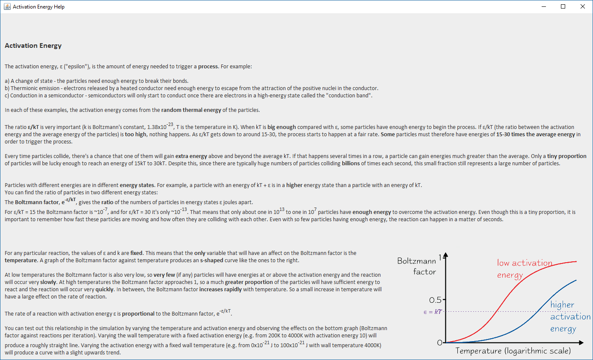

# A Teaching Tool for Basic Particle Physics
# Final Year Project - A Teaching Tool for Basic Particle Physics #
## About ##
The aim of this project was to create a software teaching tool that allows the user to investigate the properties of an ideal gas through the use of a particle simulation. The initial simulation, along with the mechanisms for the user to control the simulation, was created in Java, and allowed the user to investigate the properties of ideal gases. The functionality of this simulation was then extended to explain the more advanced concepts of heat engines and activation energy. This was achieved by including tools and graphics to relate the behaviour of the particles to the to the properties of the gas as a whole. 

Read more about the project in the report, located at /doc/report.pdf.

## Learning Outcomes ##

The core part of this project involved approximating the expected real-world behaviour of the particles within the model of the simulation. Some aspects of the model, such as resolving collisions, could be done very accurately with relatively simple and established equations. However, other parts of the simulation did not have a proven equation to rely on and thus required lots of experimentation to produce results as accurately as possible. Through this process, I improved my ability to map a written equation into workable code, as well as my ability to gather data and create an equation to approximate the trend of expected results.

Since this is the largest solo project that I have worked on to date, I put a lot of thought into creating clean code on top of a flexible software architecture. The software was therefore developed under the model-view-controller (MVC) design pattern which enabled the flexibility I was looking for due to the logical separation of the major components of the software. By making use of the MVC design pattern, along with regular refactoring, the code remained readable and scalable throughout the project. In doing this, I gained a wealth of experience in a very important aspect of working on large software projects, particularly within a team of developers.

Another important design choice for working on a more complex project was the consideration of threads, and analysing the trade off between simplicity and performance. In this project, threads were used and managed in a way to avoid concurrent access problems across the software. In the main Simulation class only one thread is used, which regularly updates the particles in the simulation. Not only does this make thread safety simple, it also made the design and implementation of the simulation much easier. Using just a single thread resulted in weaker performance, but for the purposes of the project this level of performance was adequate. Several other threads are used to manipulate and extract information from the simulation, as part of the MVC design pattern. Whenever a change is requested in the simulation that would affect an iteration in progress, such as altering the number of particles, this change is noted and then updated in the next iteration. This prevents errors and odd behaviour in the simulation. Careful consideration of concurrency has provided me with a solid basis of experience in using throughds correctly and handling thread safety across the project.

A number of optimisations were necessary to achieve a consistent level of perfomance in the simulation. One notable optimisation was the handling of collision detection within the simulation. A number of different approaches and the pros and cons of each were analysed before I chose to check for overlaps. In this instance, two particles were considered to be colliding when the distance between them was less than the sum of their radii. This is an exceptionally simple method with excellent performance that provided enough accuracy for my use case. An additional optimisation made was to consider the squared distance between particles. This produced identical results but avoided the use of the costly square root function being used in a O(n^2) algorithm. 

Another optimisation involved storing completed iterations of the simulation in a buffer before rendering that buffer on the screen. In this case, a buffer is a snapshot of the particles and the width of the container at the end of an iteration. By storing multiple snapshots in the buffer, microstutters caused by varying system performance are eliminated as there is a backlog of snapshots to render. One added benefit of this is that a simple benchmark can be ran by setting the maximum size of the buffer to a very large number and timing how long until the simulation completely fills the buffer. This method of benchmarking was used in the early phases of development to test the effects that small optimisations had on the overall performance of the software. This enabled me to experiment with different possible optimisations to find which were most effective and to learn some general rules for writing more efficient code. 

Possibly the largest learning outcome of the project was the important of great user interface design and usability. When users focus their attention on how to use the software, they put much less of their attention on actually learning from it, thereby diminishing the effectiveness of the teaching tool as a whole. This made me realise the important of good usability when creating a complex program, and even more so when creating a teaching tool. On top of this, I discovered it is very difficult to provide a feature-rich experience without overloading the user with information. I applied Nielson's ten usability heuristics to improve the user interface, but it is clear from user feedback that the usability of the software is its weakest point, and in future projects more work needs to be done and more feedback gathered to improve the usability of the software.

## Tour of the Software ##

The above screenshot shows the software in the heat engines mode. Particles collide with the walls and each other in the container located in the centre of the software. The handle attached to the right wall allows the user to move this wall. The parameters of the simulation can be altered using the control bar at the bottom of the software. 

In this mode there are three graphs: a histogram showing the distribution of the speeds of the particles; a pressure (y-axis) against volume (x-axis) graph; and a temperature (y-axis) against entropy (x-axis) graph. 

The pressure-volume and temperature-entropy graphs are primarily used to demonstrate the Carnot heat engine cycle. This can be done by using the “Single Carnot” or “Continual Carnot” buttons, which create either one cycle or as many as the user would like. 

The help screen above describes and explains the basics of heat engines and the Carnot cycle. This highlights the crucial information that a user needs to understand to experiment with the simulation in confidence. The diagrams included specify the model of the Carnot cycle as well as relate the description of the cycle to a more realistic representation and to the simulation itself.

When in activation energy mode, particles are by default coloured red when they have energies greater than the activation energy. 

In the activation energy mode there are also three graphs: a histogram showing the distribution of the speeds of the particles; a histogram showing the distribution of the energies of the particles; and a graph of Boltzmann factor (y-axis) against reactions per iteration (x-axis). 

The energy histogram is included to observe the comparison between the distribution of the particles’ energies and their speeds. The bars that are highlighted red represent particles that have energies greater than the activation energy.

The help screen above describes and explains the basics of activation energy. Since the basic concept of activation energy is relatively simple, this help screen goes through some examples of processes that are triggered when particles reach the activation energy, in addition to providing an understanding of how the activation energy relates to the Boltzmann factor. 

To quickly find out about a component the user can hold their mouse cursor over it and a tooltip will pop up. To find more detailed information and some explanations of how best to use the software, an additional information screen is provided when pressing the “INFO” button in the top right of the simulation. 
